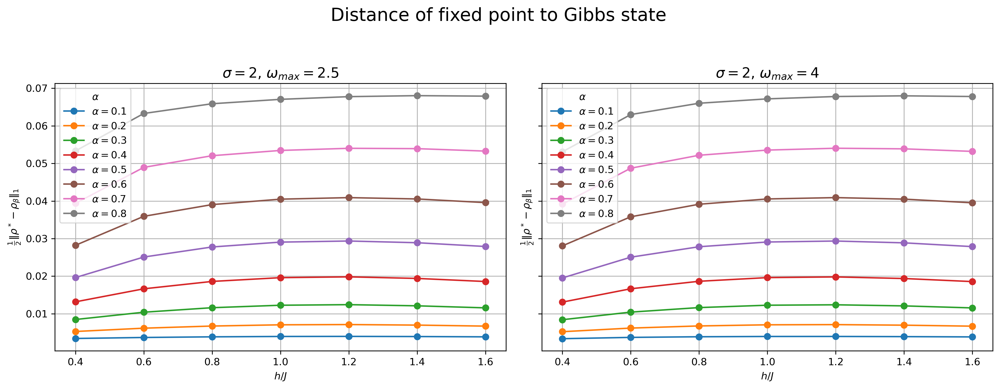

# Ground-State Preparation via Quantum Channels

Research implementation of quantum-channel algorithms for ground- and
thermal-state preparation. The repository develops and evaluates cooling-based
protocols for small quantum many-body systems, using exact diagonalization and
explicit channel construction as reference tools.

This is a project for the QIST master's programme at TU Wien, supervised by
S. Andergassen and T. Ayral.

## Scope

The current implementation focuses on the transverse-field Ising model (TFIM).
It constructs an ancilla-assisted cooling circuit, averages the resulting
channels over interaction operators and frequencies, and studies convergence
towards a Gibbs state through trajectory and spectral diagnostics.

The code is intended for exploratory research on small systems. It is not a
general-purpose quantum-simulation library.

## Installation

The Python code requires Python 3.11+ and the dependencies listed in
[`requirements.txt`](requirements.txt):

```bash
python -m venv .venv
source .venv/bin/activate
pip install -r requirements.txt
```

Some validation and reference calculations use Julia through `juliacall`.
From the repository root, instantiate the Julia environment with:

```bash
julia --project=. -e 'using Pkg; Pkg.instantiate()'
```

## Quick check

Run the exact-diagonalization regression test:

```bash
pytest tests/test_ed.py
```

## Main workflows

### Cooling trajectories

`path_analysis.py` provides `run_TFIM(...)` for simulating the cooling circuit
on a small TFIM system. The routine compares the output state with the exact
Gibbs state using trace distance and can generate convergence plots.

The circuit construction itself lives in `cooling_channel.py`:

- `transverse_ising_hamiltonian(...)` builds the TFIM Hamiltonian.
- `construct_opset(...)` defines the sampled system--ancilla interactions.
- `create_cooling_circuit(...)` returns a PennyLane QNode for repeated cooling
  steps.

### Averaged-channel analysis

`superoperator.py` provides averaged-channel construction, spectral diagnostics,
fixed-point checks, trace-distance calculations, normality residuals, and
iteration estimates.

Use the parallel scripts for batch calculations:

```bash
python parallel_h_sweep.py --N 4 --h_min 0.1 --h_max 2.0 --h_points 20
python parallel_beta_sweep.py --N 4 --beta_min 0.1 --beta_max 2.0 --beta_points 20
python parallel_grid.py --N 4 --h_points 10 --alpha_points 6 --sigma_points 5 --omega_points 2
```

`parallel_grid.py` can construct channels with either `--method superoperator`
or `--method kraus`. The other parallel sweep scripts use a matrix-free Kraus
representation.

Pass `--dense-spectrum` to diagonalize the complete channel matrix and obtain
exact `Delta_sep` and `Delta_gap` values. Without this option, the code uses
ARPACK to obtain only a small part of the spectrum.

Results are saved as `.npz` files. The default directories are `data/` for
single runs and standard sweeps, `data/grid/` for grid calculations, and
`data/nelder_mead/` for optimization runs. The notebooks
`sweep_analysis.ipynb`, `grid_analysis.ipynb`, and
`nelder-mead-trajectory-analysis.ipynb` inspect these outputs.

> **Scaling note:** a dense channel matrix has dimension
> \(4^N \times 4^N\). Dense-spectrum calculations are therefore practical only
> for small `N`. In the matrix-free parallel workflows, `--dense-spectrum` and
> `--save-channel` are rejected above a channel dimension of 4096.
> `--dense-spectrum` computes a dense matrix temporarily; `--save-channel`
> additionally stores it in the output archive.

### Nelder-Mead optimization

`nelder_mead_average.py` optimizes `alpha`, `omega_max`, `sigma`, `T`, and
`tau` for fixed `h/J` and `beta`, minimizing the number of iterations subject
to a trace-distance constraint:

```bash
python nelder_mead_average.py --h-over-J 1.2 --beta 1.0
```

`nelder_mead_h_sweep.py` repeats that optimization across a field range:

```bash
python nelder_mead_h_sweep.py --beta 1.0 --h_min 0.2 --h_max 2.0 --h_points 20
```

These workflows always use the dense spectrum. Each result archive records the
optimal parameters, convergence status, trace distance, and iteration count.

## Preliminary results

For the explicitly constructed averaged channel of a normalized four-qubit
TFIM, the tested cooling trajectories converge towards the channel fixed point
across the sampled field range. The iterations needed to reach trace distance
below `0.05` from that fixed point generally decrease in the paramagnetic
regime.

The experiments show an accuracy--speed trade-off in the coupling `alpha`:
weaker coupling yields fixed points closer to the exact Gibbs state but takes
more iterations. In the reported `N=4`, `beta=1` sweep, `alpha=0.25` and
`0.5` produced fixed points within `0.1` trace distance of the Gibbs state;
stronger coupling converged faster but with larger fixed-point error.



*Fixed-point trace distance for the N=4, beta=1 grid data at sigma=2. Lower is
closer to the target Gibbs state.*

These are small-system, noiseless numerical observations. They depend on the
chosen initial state, Trotterization, and frequency quadrature, and do not yet
establish performance for larger systems or the planned impurity model.

## Repository guide

- `cooling_channel.py` — cooling-channel and circuit construction.
- `superoperator.py` — averaged quantum channels and spectral analysis.
- `ed.py`, `ed.jl` — exact diagonalization and Gibbs-state reference methods.
- `path_analysis.py` — cooling trajectories and convergence metrics.
- `parallel_average.py` — one averaged-channel calculation.
- `parallel_h_sweep.py`, `parallel_beta_sweep.py`, `parallel_grid.py` —
  parallel parameter-sweep entry points.
- `nelder_mead_average.py`, `nelder_mead_h_sweep.py` — constrained parameter
  optimization and h/J optimization sweep.
- `*_analysis.ipynb`, `nelder-mead-trajectory-analysis.ipynb` — notebook-based
  analysis.
- `data/` — generated numerical results.
- `docu/` — technical documentation and figures.

## Research direction

Planned work includes applying the method to a 1+2-site impurity/bath DMFT
model and investigating the effects of noise and resource constraints. Open
questions include effective-temperature descriptions of noise, the resources
needed to resolve phase transitions, and hybrid cooling/filtering strategies
for impurity Green's functions.

## References

- Ding et al., [arXiv:2508.05703](https://arxiv.org/abs/2508.05703)

## License

This project is licensed under the MIT License. See [`LICENSE`](LICENSE).
